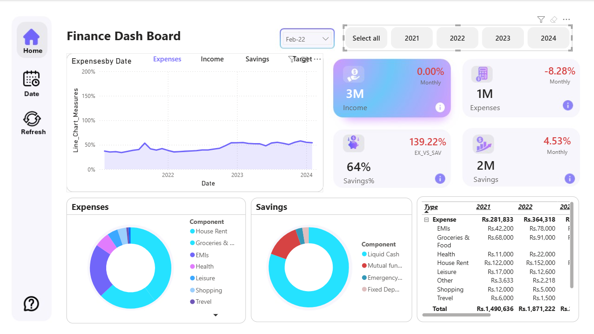

# 💰 Finance Analytics Dashboard

## 📌 Project Overview

The **Finance Analytics Dashboard** is an interactive business intelligence project designed to analyze and visualize financial data such as revenue, expenses, profit, cash flow, and financial performance trends.
It converts raw financial records into **clear, actionable insights** to support informed decision-making and financial planning.

This project demonstrates strong skills in **financial analysis, data visualization, and business storytelling** using modern BI tools.

---

## 🎯 Objectives

* Monitor overall financial performance
* Analyze revenue, expenses, and profitability
* Track financial trends over time
* Identify cost drivers and revenue contributors
* Support data-driven financial decision-making

---

## 📊 Dashboard Features

* 📈 **Revenue & Expense Trends**
* 💵 **Profit & Loss (P&L) Overview**
* 🏦 **Cash Flow Analysis**
* 🧾 **Expense Category Breakdown**
* 🏷️ **Revenue by Product / Category / Region**
* 📊 **Monthly & Yearly Financial Performance**
* 🎛️ Interactive filters and slicers for:

  * Date range
  * Category / Department
  * Region / Business unit

---

## 🧠 Key Insights

* Identifies profitable and loss-making periods
* Highlights major expense contributors
* Tracks revenue growth and seasonality
* Monitors cash inflow vs outflow
* Supports budgeting and financial forecasting

---

## 🛠️ Tools & Technologies

* **Power BI / Tableau** – Dashboard & Visualization
* **Excel / CSV Dataset**
* **Data Cleaning & Transformation**
* **Basic Financial Modeling**

---

## 📂 Dataset Description

The dataset contains simulated or real financial records with attributes such as:

* Date
* Revenue
* Expenses
* Profit
* Expense Category
* Revenue Category
* Region / Department
* Transaction Amount

---

## 🚀 How to Use

1. Open the dashboard file using **Power BI Desktop / Tableau**
2. Apply filters to explore specific financial periods or categories
3. Analyze revenue, expenses, and profitability
4. Extract insights to support financial decisions

---

## 📈 Use Cases

* Business financial performance analysis
* Budgeting and cost control
* Financial reporting & KPI monitoring
* Data visualization practice
* Portfolio project for data analytics or finance roles

---

## 📌 Future Enhancements

* Add financial forecasting and trend prediction
* Integrate budget vs actual analysis
* Include ratio analysis (ROI, profit margin, growth rate)
* Drill-through pages for detailed transaction analysis
* Automated data refresh with real-time sources

---
## 📸 Dashboard Preview

<table> 
<tr>
<td></td>
<td></td>
</tr>
</table>

---

## 👤 Author

**Kushan Ruwan Pathirana**
Aspiring Data Analyst | Business Intelligence Enthusiast

---

## 📬 Contact

If you have feedback or suggestions, feel free to connect with me:

* **LinkedIn:** [Kushan Ruwan Pathirana](https://www.linkedin.com/in/kushan-ruwan-pathiran)
* **GitHub:** [KushanRuwanPathirana](https://github.com/KushanRuwanPathirana)

---

## 📜 License

This project is licensed under the **MIT License**.

* Rewrite it to match **academic assignment requirements**
* Optimize it for **data analyst job portfolios**
